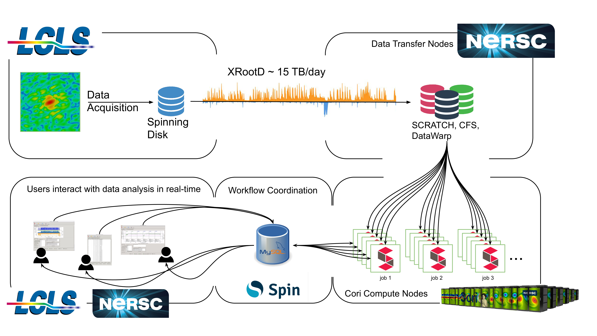

Using CCTBX in a Superfacility Workflow
=======================================

Realtime data analysis is a powerful tool, enabling rapid descision making
during experiments. Unlike traditional simulation workloads, fast feedback, and
automatic data management are central features of this workflow. We therefore
use a "Superfacility" paradigm to computing, where HPC is a reactive element
which is tightly coupled to the experiment's data processing pipeline. `A
recent publication <https://arxiv.org/abs/2106.11469>`_ demonstrates these
workflows at NERSC. Critical for resiliancy is to enable failover to other
facilities.

The following figure outlines the LCLS + NERSC workflow.

    Example of the NERSC-LCLS Superfacility workflow. Data is collected at LCLS
    (upper left box) where it is stored on disk. Once an experimental run is
    completed, a XRootD cluster automatically copies all of the files for that
    run to the SCRATCH Lustre file system at NERSC (central arrow -- orange
    spikes show instantaneous data transfer rate over ESNet, each spike being
    the data for one run). Once the data for a run has been completely
    transferred to NERSC, the cctbx.xfel pipeline management tool (running on a
    login node, bottom left box) automatically submits data analysis jobs
    (running in shifter containers, bottom right box). The data analysis at
    NERSC are coordinated by a MySQL database hosted on the Spin microservices
    platform (bottom center box).

CCTBX
-----

Data was analyzed using the `Computational Crystallographic Toolbox (CCTBX)
<https://github.com/cctbx/cctbx_project>`_. CCTBX is a software framework to
perform serial crystallographic data analysis on high-performance computing
systems. Data analysis involves processing anywhere between hundreds of
thousands to millions of images. These are stored as arrays of pixel intensity
values. Here we focus on a subset of features and algorithms -- called
*cctbx.xfel* -- which specialize in SFX experimental data analysis. The result
of data processing is a list of features (such a Bragg spot shape, and Miller
indices) derived from the input data set, as well as refined experimental
parameters (such as detector position and orientation relative to the beam).

*cctbx.xfel* is a python package which is designed to interface with other SFX
data analysis workflows, such as `DAILS <https://dials.github.io/>`_. This
makes it highly versatile, and allows non-software specialists to implement
data analysis algorithms. Furthermore, most experimental facilities provide
custom software packages to interface with facility data collection and
logging. These packages almost always provide a Python API. Therefore the data
analysis coordinated and scripted using Python

The computationally intensive work is implemented in C++, and recent work makes
use of CUDA and `Kokkos <https://github.com/kokkos/kokkos>`_ for some of the
most computationally expensive algorithms. *cctbx.xfel* makes use of a
producer/consumer model to distribute parallel work over MPI ranks. openMP is
enabled for single-rank parallelism.

Pipeline Management
^^^^^^^^^^^^^^^^^^^

.. important::
    EFEL data analysis requires interactive pipeline management tools in order
    to effectively provide fast feedback to experiment operators.

*cctbx.xfel* provides a complete pipeline management systems in the form of a
graphical user interface. Either by monitoring a directory for new data, or by
using the experimental facility's API (if one exists) *cctbx.xfel*
automatically detects new data (grouped into "runs"). The user can choose to
tag these experimental runs with scientifically-relevant tags, similar to a log
book. Runs are grouped into "trials", which share the same parameters for data
analysis. *cctbx.xfel* automatically detects unprocessed trials (either because
new data has come in, or the user submitted new data analysis parameters), and
submits new job scripts. As the data processing jobs run, they report the
status of the data analysis in real time to a central mySQL data base. This
allows scientists to follow the complete data analysis from start to finish,
and make rapid decisions about their experiments.

*cctbx.xfel* can compose and submit jobscripts for a variety of job schedulers
(Slurm, PBS, LFS, and SGE) and CCTBX parameter files. By comparing available
data, user inputs, and the list of completed jobs (from the mySQL database
described below) new jobs can be automatically submitted. E.g. when new data
files have finished transferring, or if the users modify the analysis
parameters. Once data analysis parameters have been broadcast to all MPI ranks,
data processing occurs independently for each image until the final step. Since
each image can be very different (and often doesn't contain the same features),
the per-image data processing time can vary vastly.  Hence, in order to remain
load-balanced between MPI ranks, we employ producer/consumer parallelism.

In order to coordinate data analysis among different users and Slurm jobs, each
*cctbx.xfel* instance running on the compute nodes connects to a MySQL
database, and "reports" the images it is analyzing together with analysis
parameters and outcomes (e.g. successful spot finding). This allows instant
feedback on the outcomes of the data analysis amongst many users at once.
Therefore the database needs to be able to accept potentially thousands of
connections at once. We find that a MySQL database instance hosted on NERSC's
"Spin" micro-services platform is capable of accommodating the required rate
of database transactions. In past experiments, we observed a peak peak of
approx 8000 *commit* transactions per second, which Spin is capable of
accommodating.

Cross-Facility Communication
^^^^^^^^^^^^^^^^^^^^^^^^^^^^

For experiments conducted at the LCLS light source, we use `psana
<https://github.com/slac-lcls>`_ to access raw data and orchestrate parallel
I/O. The LCLS provides a REST API which exposes the state of an experimental
run (and data transfer) to external facilities. A run can be in one of the
following states

#. The run is ongoing and data is still being collected into xtc "streams".
#. The run is completed and data is being transferred.
#. The run is completed and data has been transferred to NERSC.

*cctbx.xfel* monitors this API from NERSC or from LCLS. If it is running at
LCLS, then it can commence with data analysis when the API returns state 2. If
it is running at NERSC, then data the GUI presents the run for analysis only
once the API returns state 3.

Facility Requirements
^^^^^^^^^^^^^^^^^^^^^

When running at on a supercomputer, this workflow requires three types of nodes:

* Many (64 and more) compute nodes: run the computationally-intensive data
  analysis tasks (image processing and data reduction).
* One workflow coordinate node: hosts database of done and new work, as well as
  workflow statistics -- this is fairly light weight, just needs to be scalable
  and have a fast network connection to the compute nodes.
* Pipeline management nodes: run the GUI which is used by the science teams --
  more often than not, this will just be a login node.

Portability
-----------

.. attention::
    This section is WIP

Portability requires that the data movement, data analysis, and workflow
orchstration components be independent of the HPC environment where data
processing takes place. While some amount of customization is inevitable, we
improved portability by employing the following
technologies:

1. Enable data to be "sent everywhere" at short notice.
2. Build protable containers for the data analysis software. This allows rapdi
   re-deployment at a new site.
3. Host workflow orchestration on Kubernetes-based microservices platforms.
   This minimizes the amount of custom (site-local) pipeline management code.

.. figure:: ./assets/cctbx_portability.png

   Portability experiences of the CCTBX Superfacility workflow accross 4
   facilties: `NERSC <https://www.nersc.gov>`_, `OLCF
   <https://www.olcf.ornl.gov>`_, `ALCF <https://www.alcf.anl.gov>`_, `LCLS
   <https://lcls.slac.stanford.edu/>`_

.. attention::
    TODO: Add links beween list and sections

Data Movement
^^^^^^^^^^^^^

.. attention::
    This section is WIP
    TODO: i) Describe how datafed solves the problem of accessing data from
    anywhere

Use Portable Containers
^^^^^^^^^^^^^^^^^^^^^^^

.. attention::
    This section is WIP
    TODO: copy relevant points from links

Instructions for building containers that run on shifter and singularity
(without rebuilding):

1. https://docs.nersc.gov/development/shifter/how-to-use/#using-mpi-in-shifter
2. https://docs.nersc.gov/development/languages/python/parallel-python/#mpi4py
3. https://www.alcf.anl.gov/support-center/theta/singularity-theta

Workflow Orchestration and Microservices
^^^^^^^^^^^^^^^^^^^^^^^^^^^^^^^^^^^^^^^^

.. attention::
    This section is WIP
    TODO: i) add Jason Kincl's noVNC example; ii) add OLCF Slate experiences -- how to make portable Microservices

